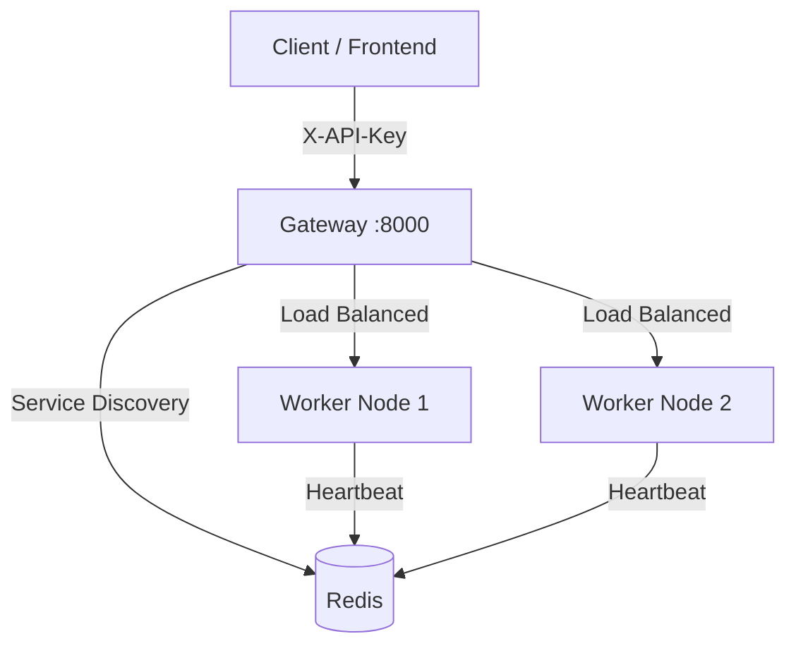

# Browser RPC

> High-performance browser automation RPC service based on Playwright + gRPC with powerful anti-detection capabilities. Now supports Distributed Architecture and Docker Deployment.

[](https://github.com/LBatsoft/browser_rpc/actions/workflows/ci.yml)

## ✨ Core Features

**核心能力 - Browser RPC 服务**:
- 🔌 **gRPC Interface**: 13 standardized RPC APIs for browser automation
- 🛡️ **Powerful Anti-Detection**: playwright-stealth + custom scripts to bypass common bot detection
- 📡 **Network Interception**: Complete request/response capture capabilities
- 🚀 **High Performance**: Multi-session concurrency with resource pool management
- 🎯 **Full Browser Control**: Navigate, execute scripts, interact with elements, take screenshots

**扩展功能（可选）**:
- 🔌 **Unified Gateway**: Distributed architecture with Gateway as single entry point (Load Balancing & Routing)
- 🐳 **Docker Ready**: One-click deployment with Docker Compose
- 🖥️ **Remote Control UI**: Real-time browser remote control with multi-tab support
- 🔒 **Security**: API Key authentication for clients + Cluster Secret for internal communication
- 📊 **Monitoring**: Prometheus metrics and Grafana dashboards

## 🚀 Quick Start (Docker) - Recommended

The easiest way to start the distributed cluster (Gateway + Redis + Worker Nodes).

### 1. Requirements

- Docker & Docker Compose

### 2. Start Cluster

```bash
docker compose up --build -d
```

### 3. Verify

Access the remote control interface:
http://localhost:8000/static/remote.html

> Note: By default, `API_KEY` is set to `dev-test-key`. You might need to configure headers if using the UI directly, or disable auth in `docker-compose.yml` for testing.

## 🧪 Local Testing (Non-Docker)

For local development and testing without Docker, you can start all services manually.

### Quick Start (One Command)

```bash
python scripts/start_local_test.py
```

This script will:
- ✅ Check and start Redis (if not running)
- ✅ Start 2 Worker nodes (ports 8001, 8002)
- ✅ Start Gateway (port 8000)
- ✅ Run automatic API tests
- ✅ Display access URLs

Press `Ctrl+C` to stop all services.

### Manual Setup (Step by Step)

**1. Start Redis** (if not installed):

```bash
# macOS
brew install redis
brew services start redis

# Linux
sudo apt-get install redis-server
sudo systemctl start redis
```

**2. Start Worker Node 1** (Terminal 1):

```bash
export HTTP_PORT=8001
export MAX_SESSIONS=5
export REDIS_URL=redis://localhost:6379/0
export CLUSTER_SECRET=dev-cluster-secret
export NODE_HOST=localhost
python http_server.py
```

**3. Start Worker Node 2** (Terminal 2):

```bash
export HTTP_PORT=8002
export MAX_SESSIONS=5
export REDIS_URL=redis://localhost:6379/0
export CLUSTER_SECRET=dev-cluster-secret
export NODE_HOST=localhost
python http_server.py
```

**4. Start Gateway** (Terminal 3):

```bash
export REDIS_URL=redis://localhost:6379/0
export API_KEY=dev-test-key
export CLUSTER_SECRET=dev-cluster-secret
python gateway.py
```

**5. Test the Setup**:

```bash
python scripts/test_gateway_local.py
```

### Access URLs

- **Gateway**: http://localhost:8000
- **Remote Control UI**: http://localhost:8000/static/remote.html
- **API Documentation**: http://localhost:8000/docs

### Notes

- For local testing, `NODE_HOST` should be set to `localhost` (not container names)
- Ensure Redis is running before starting services
- The script will automatically check Redis availability

## 📦 Installation (Local Development)

### 1. Install Dependencies

```bash
pip install -r requirements.txt
```

### 2. Compile Proto Files

```bash
python -m grpc_tools.protoc -I./proto --python_out=. --grpc_python_out=. ./proto/spider.proto
```

### 3. Install Browser

```bash
playwright install chromium
```

## 💻 Usage

### Core: gRPC RPC Interface (Recommended)

**This is the core of Browser RPC** - High-performance gRPC interface for browser automation.

#### Basic Python Example (RPC)

```python
import asyncio
from rpc_client import BrowserRPCClient

async def main():
    # Connect to RPC server
    client = BrowserRPCClient(host='localhost', port=50051)
    await client.connect()
    
    try:
        # 1. Create Session
        session_id = await client.create_session(
            headless=True,
            user_agent="Mozilla/5.0...",
            width=1920,
            height=1080
        )
        print(f"Session Created: {session_id}")
        
        # 2. Navigate
        final_url = await client.navigate('https://www.example.com', timeout=30)
        print(f"Navigated to: {final_url}")
        
        # 3. Execute JavaScript
        title = await client.execute_script("document.title")
        print(f"Page Title: {title}")
        
        # 4. Get Page Content
        html = await client.get_page_content()
        print(f"Page HTML: {len(html)} bytes")
        
        # 5. Network Interception
        requests = await client.get_network_requests(url_pattern=r'/api/.*')
        print(f"Captured {len(requests)} API requests")
        
        # 6. Element Operations
        await client.wait_for_element('button#submit', timeout=10)
        await client.click_element('button#submit')
        await client.type_text('input#username', 'myname')
        
        # 7. Screenshot
        image_data = await client.take_screenshot(full_page=True)
        with open('screenshot.png', 'wb') as f:
            f.write(image_data)
        
    finally:
        await client.close()

asyncio.run(main())
```

#### Start RPC Server

```bash
# Start RPC server (default port: 50051)
python rpc_server.py

# Or use script
./scripts/start_rpc_server.sh
```

**📚 See [Core Features Documentation](./docs/CORE_FEATURES.md) for detailed RPC API reference.**

> **Note**: The core of Browser RPC is the **gRPC RPC service**. HTTP API and Gateway are optional enhancements for easier integration. For best performance, use the gRPC interface directly.

### HTTP API (via Gateway) - Optional

The system also provides a RESTful API via the Gateway (Default port: 8000) for easier integration.

**Authentication Headers:**
- `X-API-Key`: `dev-test-key` (Default in docker-compose.yml)

#### Basic Python Example

```python
import requests

GATEWAY_URL = "http://localhost:8000"
HEADERS = {"X-API-Key": "dev-test-key"}

# 1. Create Session
resp = requests.post(f"{GATEWAY_URL}/api/sessions", json={"headless": True}, headers=HEADERS)
session_id = resp.json()["session_id"]
print(f"Session Created: {session_id}")

# 2. Navigate
requests.post(
    f"{GATEWAY_URL}/api/sessions/{session_id}/navigate",
    json={"url": "https://www.google.com"},
    headers=HEADERS
)

# 3. Take Screenshot
requests.post(
    f"{GATEWAY_URL}/api/sessions/{session_id}/screenshot",
    json={"full_page": False},
    headers=HEADERS
)

# 4. Close Session
requests.delete(f"{GATEWAY_URL}/api/sessions/{session_id}", headers=HEADERS)
```

### API Documentation

Once started, visit: http://localhost:8000/docs

## 🏗️ Architecture

The system has evolved into a distributed microservices architecture:



- **Gateway**: Handles Auth, Load Balancing, and Request Routing.
- **Worker Node**: Executes browser automation tasks (Playwright).
- **Redis**: Stores node registry, heartbeats, and session mapping.

## 🔧 Configuration

Configuration is managed via Environment Variables (or `config.py` defaults).

| Variable | Description | Default |
|----------|-------------|---------|
| `REDIS_URL` | Redis connection string | `redis://localhost:6379/0` |
| `HTTP_PORT` | Service listening port | `8000` |
| `MAX_SESSIONS` | Max concurrent sessions per node | `10` |
| `API_KEY` | Client access token | `None` (Disabled) |
| `CLUSTER_SECRET` | Internal communication secret | `None` (Disabled) |

## 🗂️ Project Structure

```
browser_rpc/
├── src/browser_rpc/          # Main package
│   ├── client/              # Client code (RPC & HTTP)
│   ├── server/               # Server code (RPC, HTTP, Gateway)
│   ├── core/                # Core modules (CDP, config, metrics, registry)
│   └── proto_gen/           # Generated proto files
├── proto/                    # gRPC definitions
├── static/                   # Remote Control UI
├── scripts/                  # Helper scripts
├── gateway.py                # Gateway entry point (backward compatible)
├── http_server.py            # Worker entry point (backward compatible)
├── rpc_server.py             # RPC server entry point (backward compatible)
├── docker-compose.yml        # Docker orchestration
└── Dockerfile                # Container definition
```

## 🛡️ Anti-Detection Capabilities

- ✅ `navigator.webdriver` hidden
- ✅ `window.chrome` object mocked
- ✅ Automation traces removed
- ✅ WebGL fingerprint consistency
- ✅ Permission state simulation

## 📋 Specification-Driven Development (SDD)

This project uses **LeanSpec** for Specification-Driven Development. All changes should be based on specifications in the `specs/` directory.

### Quick Reference

```bash
# View project status
lean-spec board

# List all specs
lean-spec list

# View a spec
lean-spec view 001-browser-rpc-core

# Create new spec
lean-spec create feature-name --tags feature --priority high

# Update spec status
lean-spec update spec-name --status in-progress
```

**See [LeanSpec Guide](./docs/lean-spec-guide.md) for detailed usage.**

### Current Specs

- `001-browser-rpc-core` - Core RPC service (✅ Complete)
- `002-distributed-architecture` - Distributed architecture (✅ Complete)
- `003-monitoring-observability` - Monitoring & observability (✅ Complete)
- `004-region-aware-routing` - Region-aware routing (✅ Complete)
- `005-kubernetes-deployment` - K8s deployment (✅ Complete)

## 📄 License

MIT License - see [LICENSE](LICENSE) file for details

---

**Version**: 2.0.0 (Distributed)
**Status**: ✅ Production Ready
**SDD**: ✅ LeanSpec-based
