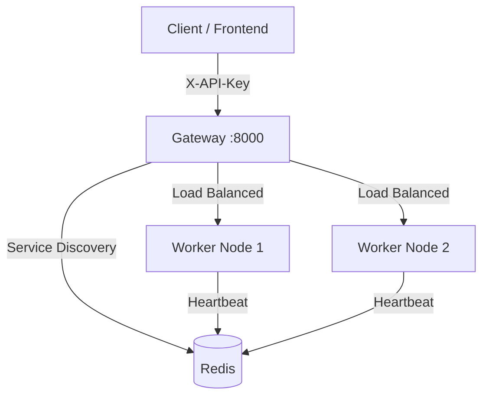

# Browser RPC

> High-performance browser automation RPC service based on Playwright + gRPC with powerful anti-detection capabilities. Now supports Distributed Architecture and Docker Deployment.

[](https://github.com/LBatsoft/browser_rpc/actions/workflows/ci.yml)

## ✨ Features

- 🛡️ **Powerful Anti-Detection**: playwright-stealth + custom scripts to bypass common bot detection
- 🔌 **Unified Gateway**: Distributed architecture with Gateway as single entry point (Load Balancing & Routing)
- 🐳 **Docker Ready**: One-click deployment with Docker Compose
- 🖥️ **Remote Control UI**: Real-time browser remote control with multi-tab support
- 📡 **Network Interception**: Complete request/response capture capabilities
- 🚀 **High Performance**: Supports multi-session concurrency with resource pool management
- 🔒 **Security**: API Key authentication for clients + Cluster Secret for internal communication

## 🚀 Quick Start (Docker) - Recommended

The easiest way to start the distributed cluster (Gateway + Redis + Worker Nodes).

### 1. Requirements

- Docker & Docker Compose

### 2. Start Cluster

```bash
docker compose up --build -d
```

### 3. Verify

Access the remote control interface:
http://localhost:8000/static/remote.html

> Note: By default, `API_KEY` is set to `dev-test-key`. You might need to configure headers if using the UI directly, or disable auth in `docker-compose.yml` for testing.

## 📦 Installation (Local Development)

### 1. Install Dependencies

```bash
pip install -r requirements.txt
```

### 2. Compile Proto Files

```bash
python -m grpc_tools.protoc -I./proto --python_out=. --grpc_python_out=. ./proto/spider.proto
```

### 3. Install Browser

```bash
playwright install chromium
```

## 💻 Usage

### HTTP API (via Gateway)

The system provides a RESTful API via the Gateway (Default port: 8000).

**Authentication Headers:**
- `X-API-Key`: `dev-test-key` (Default in docker-compose.yml)

#### Basic Python Example

```python
import requests

GATEWAY_URL = "http://localhost:8000"
HEADERS = {"X-API-Key": "dev-test-key"}

# 1. Create Session
resp = requests.post(f"{GATEWAY_URL}/api/sessions", json={"headless": True}, headers=HEADERS)
session_id = resp.json()["session_id"]
print(f"Session Created: {session_id}")

# 2. Navigate
requests.post(
    f"{GATEWAY_URL}/api/sessions/{session_id}/navigate",
    json={"url": "https://www.google.com"},
    headers=HEADERS
)

# 3. Take Screenshot
requests.post(
    f"{GATEWAY_URL}/api/sessions/{session_id}/screenshot",
    json={"full_page": False},
    headers=HEADERS
)

# 4. Close Session
requests.delete(f"{GATEWAY_URL}/api/sessions/{session_id}", headers=HEADERS)
```

### API Documentation

Once started, visit: http://localhost:8000/docs

## 🏗️ Architecture

The system has evolved into a distributed microservices architecture:



- **Gateway**: Handles Auth, Load Balancing, and Request Routing.
- **Worker Node**: Executes browser automation tasks (Playwright).
- **Redis**: Stores node registry, heartbeats, and session mapping.

## 🔧 Configuration

Configuration is managed via Environment Variables (or `config.py` defaults).

| Variable | Description | Default |
|----------|-------------|---------|
| `REDIS_URL` | Redis connection string | `redis://localhost:6379/0` |
| `HTTP_PORT` | Service listening port | `8000` |
| `MAX_SESSIONS` | Max concurrent sessions per node | `10` |
| `API_KEY` | Client access token | `None` (Disabled) |
| `CLUSTER_SECRET` | Internal communication secret | `None` (Disabled) |

## 🗂️ Project Structure

```
browser_rpc/
├── core/
│   └── registry.py           # Service discovery & Load balancing logic
├── proto/                    # gRPC definitions
├── static/                   # Remote Control UI
├── scripts/                  # Helper scripts
├── gateway.py                # API Gateway entry point
├── http_server.py            # Worker Node entry point
├── cdp_client.py             # Playwright/CDP wrapper
├── config.py                 # Configuration loader
├── docker-compose.yml        # Docker orchestration
└── Dockerfile                # Container definition
```

## 🛡️ Anti-Detection Capabilities

- ✅ `navigator.webdriver` hidden
- ✅ `window.chrome` object mocked
- ✅ Automation traces removed
- ✅ WebGL fingerprint consistency
- ✅ Permission state simulation

## 📄 License

MIT License - see [LICENSE](LICENSE) file for details

---

**Version**: 2.0.0 (Distributed)
**Status**: ✅ Production Ready
