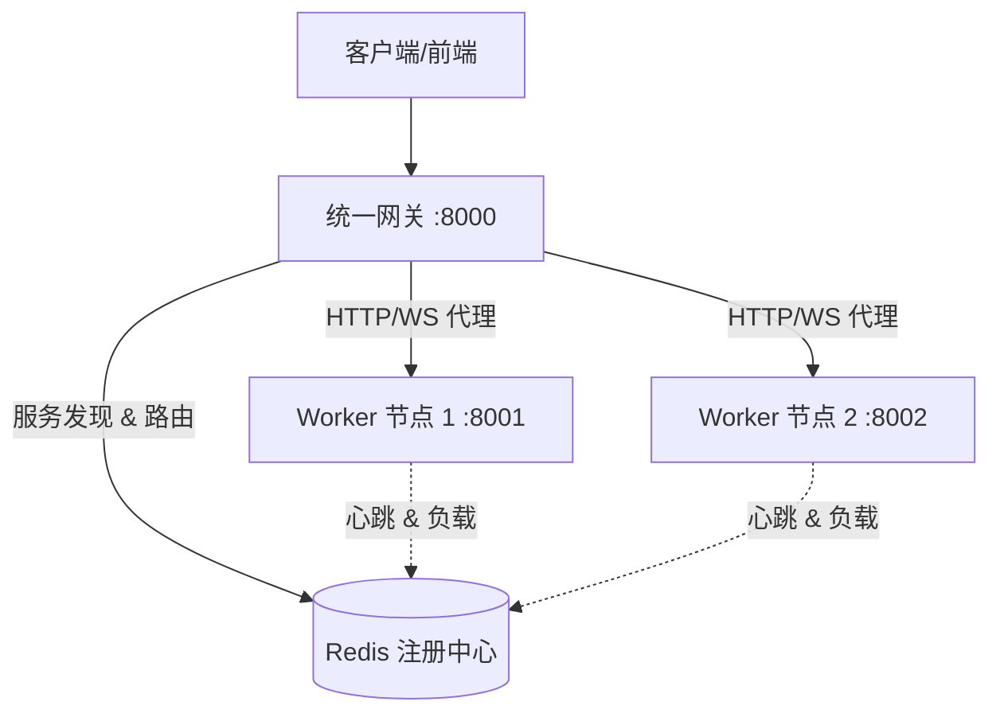

# 2025-12-17 工作总结：分布式架构演进

## 1. 工作概览
今日主要完成了项目从**单体应用**向**分布式微服务架构**的演进。通过引入 Redis 作为服务注册中心，并实现统一网关（Gateway），系统现在具备了水平扩展能力，能够支持大规模调度场景。

## 2. 完成事项

### 2.1 容器化与编排
- **Dockerfile**: 创建了统一的构建文件，支持 Worker 和 Gateway 的镜像构建。
- **Docker Compose**: 定义了本地集群拓扑，包含 Redis、Gateway 和多个 Worker 节点，实现了“一键启动”的开发环境。
- **配置管理**: 改造 `config.py`，支持通过环境变量注入配置（如 `REDIS_URL`, `HTTP_PORT`），适应容器化部署。

### 2.2 服务注册与发现 (Service Discovery)
- **NodeRegistry (`core/registry.py`)**: 
  - 实现了基于 Redis 的节点注册机制。
  - 实现了**心跳机制 (Heartbeat)**，自动剔除失效节点。
  - 实现了**负载上报**，Worker 节点实时更新当前活跃会话数。
  - 实现了简单的**负载均衡策略**（Least Connections），网关优先选择负载最低的节点。

### 2.3 统一网关 (Gateway)
- **API 网关 (`gateway.py`)**:
  - 作为集群的单一入口（Entrypoint），监听 8000 端口。
  - 实现了 HTTP 请求的透明代理，根据 `session_id` 自动路由到对应 Worker。
  - **智能路由**: 在创建会话（`POST /api/sessions`）时，自动计算并分发到最佳节点。
- **WebSocket 代理**:
  - 实现了 WebSocket 流量的双向转发，确保前端可以无感知地连接到后端任意 Worker 的 CDP 流。

### 2.4 Worker 节点改造
- 修改 `http_server.py`，在启动时自动连接 Redis 并注册自身。
- 在会话创建/销毁时同步更新 Redis 中的负载数据。

## 3. 架构现状

## 4. 待办事项 (To-Do)

### 优先事项
1. **环境验证**: 在真实的 Docker 环境（非沙箱）中运行 `docker-compose up`，验证完整的集群通信链路。
2. **健壮性增强**:
   - 网关层增加重试机制和断路器。
   - 优化 WebSocket 代理的异常处理（如后端节点重启时的重连）。
3. **安全性**:
   - 实现网关与 Worker 之间的内部认证（防止绕过网关直接访问 Worker）。
   - 增加 API Key 认证。

### 长期规划
- **跨地域调度**: 引入地域标签（Region/Zone），实现就近调度。
- **K8s 部署**: 编写 Kubernetes 部署清单（Deployment, Service, Ingress）。
- **监控告警**: 集成 Prometheus + Grafana 监控节点负载和健康状态。

