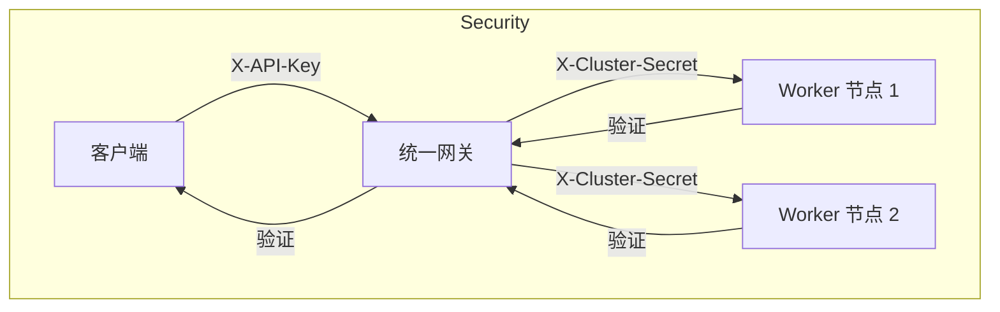

# 2025-12-18 工作总结：健壮性与安全性增强

## 1. 工作概览
今日主要针对分布式架构进行了**健壮性 (Robustness)** 和 **安全性 (Security)** 的增强。实现了网关层的重试机制、WebSocket 异常处理，以及服务间和客户端的认证机制。

## 2. 完成事项

### 2.1 健壮性增强 (Gateway Robustness)
- **HTTP 重试机制 (`gateway.py`)**:
  - `create_session`: 实现了**3次重试**逻辑。如果首选节点连接失败，会自动将该节点加入排除列表，并尝试获取下一个最佳节点。
  - `proxy_request`: 针对网络超时（Timeout）和连接错误（ConnectError）实现了重试，提高了瞬时网络抖动下的稳定性。
- **WebSocket 异常处理**:
  - 优化了 `websocket_proxy` 的错误捕获。
  - 实现了更优雅的双向关闭逻辑，当一端断开时，正确关闭另一端并记录日志。

### 2.2 安全性增强 (Security)
- **内部集群认证 (Cluster Auth)**:
  - 引入 `X-Cluster-Secret` 头。
  - **Gateway**: 在转发请求给 Worker 时，自动注入配置的 `CLUSTER_SECRET`。
  - **Worker (`http_server.py`)**: 在所有敏感接口（创建/关闭会话、控制指令、WebSocket）增加依赖注入 `verify_cluster_secret`，拒绝无密钥的非法访问。
- **客户端认证 (Client Auth)**:
  - 引入 `X-API-Key` 头。
  - **Gateway**: 增加了 `verify_client_auth` 依赖，如果配置了 `API_KEY`，则验证客户端请求。

### 2.3 配置更新
- `config.py`: 新增 `CLUSTER_SECRET` 和 `API_KEY` 配置项。

## 3. 架构现状更新

## 4. 后续规划
- **集成测试**: 需要在真实环境中验证 Auth 失败的情况和 Retry 成功的情况。
- **监控**: 接入 Prometheus 监控重试次数和错误率。

